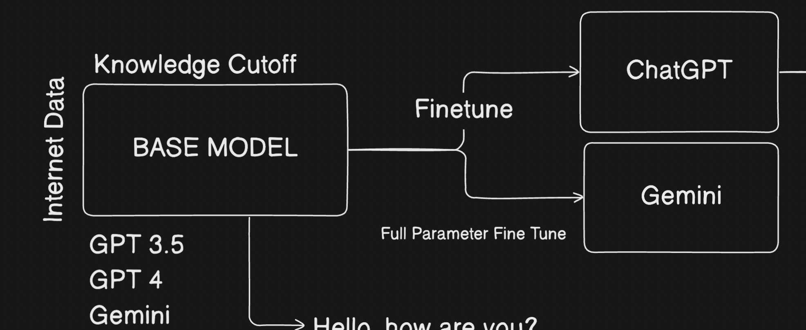
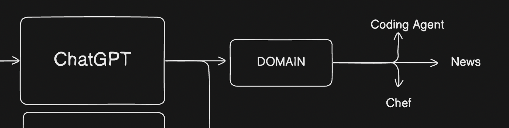

# Fine Tuning

Fine-tuning is customizing a pre-trained model (like GPT or Gemini) on specific data to adapt it for a particular task or domain.

You can do **Full fine-tuning**, parameter-efficient fine-tuning (PEFT) like **LoRA**, or instruction tuning depending on your needs and resources.

- Full fine-tuning updates all model parameters, requiring lots of compute and data.
- PEFT (like LoRA) updates only small added layers or parameters, making fine-tuning faster, cheaper, and efficient for large models.

By default the transformer models are built for next word prediction, but we can use them for other tasks like classification, summarization, etc. by fine-tuning them on specific datasets.

So we can consider that OpenAI and Google have already done the heavy lifting of training the model on a large dataset, and now we can just fine-tune it on our specific dataset to get the best results.

Additionally, we can train these fine-tuned models on a specific domain or task, like medical data, legal data, etc. to make them act like agents in those domains.

