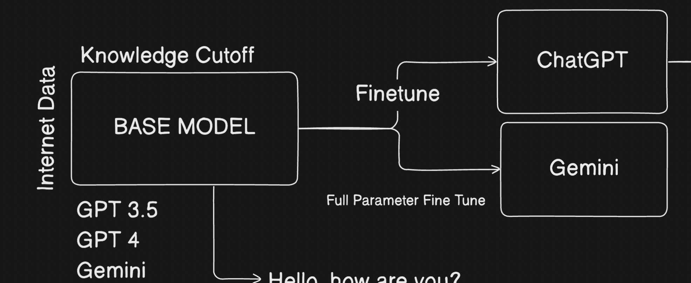

# Fine Tuning

Fine-tuning is customizing a pre-trained model (like GPT or Gemini) on specific data to adapt it for a particular task or domain.

You can do **Full fine-tuning**, parameter-efficient fine-tuning (PEFT) like **LoRA**, or instruction tuning depending on your needs and resources.

- Full fine-tuning updates all model parameters, requiring lots of compute and data.
- PEFT (like LoRA) updates only small added layers or parameters, making fine-tuning faster, cheaper, and efficient for large models.

