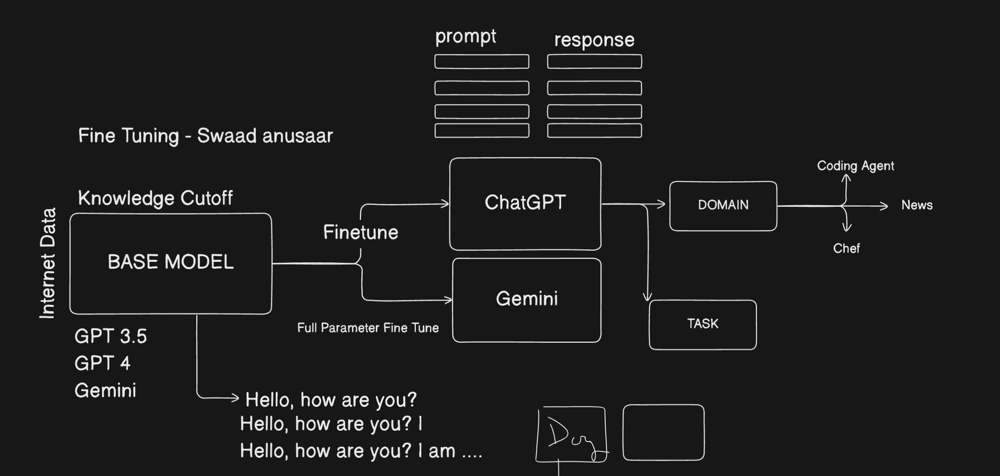

# Fine Tuning

Fine-tuning is customizing a pre-trained model (like GPT or Gemini) on specific data to adapt it for a particular task or domain.

You can do **Full fine-tuning**, parameter-efficient fine-tuning (PEFT) like **LoRA**, or instruction tuning depending on your needs and resources.

- Full fine-tuning updates all model parameters, requiring lots of compute and data.
- PEFT (like LoRA) updates only small added layers or parameters, making fine-tuning faster, cheaper, and efficient for large models.

By default the transformer models are built for next word prediction, but we can use them for other tasks like classification, summarization, etc. by fine-tuning them on specific datasets.

So we can consider that OpenAI and Google have already done the heavy lifting of training the model on a large dataset, and now we can just fine-tune it on our specific dataset to get the best results.

Additionally, we can train these fine-tuned models on a specific domain or task, like medical data, legal data, etc. to make them act like agents in those domains.

Additionally, we can also train it task specific based on a lableled dataset. For example, we can train a model to classify text into different categories, or to generate text based on a specific prompt.

## Fine tuning strategies

1. Full parameter fine-tuning
2. LoRA (Low-Rank Adaptation) fine-tuning

### Full parameter fine-tuning

Ultimately when we talk about a transformer, at the end its a neural network. They have various layers and parameters and weights that are used to predict. When a base model is fine-tuned, and you actually change actual weights of the model, this is called full parameter fine-tuning. This is the most expensive and time consuming way to fine-tune a model. It requires a lot of compute and data to do this.

- Weights: The parameters of the model that are learned during training. They are used to make predictions.

- Layers: The different levels of the model that process the input data. Each layer has its own set of weights and biases.

> In neural networks, weights are numerical values that determine the strength of connections between neurons (or nodes). They essentially control how much influence one neuron's output has on another neuron's input. These weights are learned and adjusted during the training process, allowing the network to learn patterns and make predictions.

> Backpropagation is a training algorithm for neural networks that uses a backward pass to adjust model parameters (weights and biases) based on the network's performance error. It's a crucial method for minimizing errors and improving the network's ability to make accurate predictions.

**Cons of full parameter fine-tuning:**

- High GPU cost
- High Energy cost
- High Hardware cost
- Self host cost
