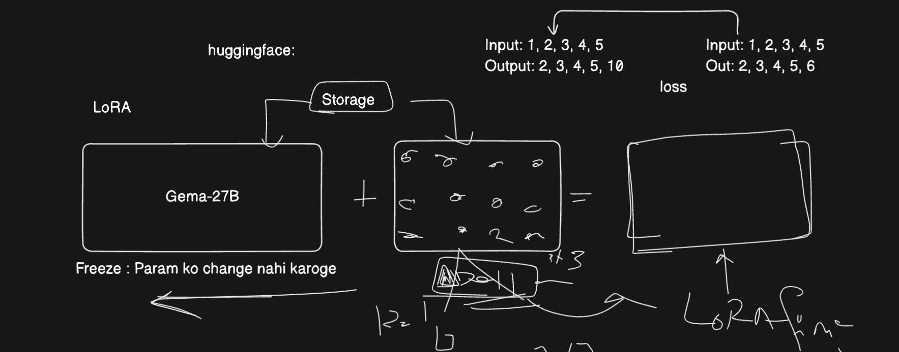

# Fine-Tuning

Fine-tuning is customizing a pre-trained model (like GPT or Gemini) on specific data to adapt it for a particular task or domain.

You can do **full fine-tuning**, parameter-efficient fine-tuning (PEFT) like **LoRA**, or instruction tuning depending on your needs and resources.

- Full fine-tuning updates all model parameters, requiring lots of compute and data.
- PEFT (like LoRA) updates only small added layers or parameters, making fine-tuning faster, cheaper, and more efficient for large models.

By default, transformer models are built for next-word prediction, but we can use them for other tasks like classification, summarization, etc., by fine-tuning them on specific datasets.

We can consider that OpenAI and Google have already done the heavy lifting of training the model on large datasets, and now we can fine-tune it on our specific dataset to get the best results.

We can also train these fine-tuned models on a specific domain or task, like medical data, legal data, etc., to make them act like agents in those domains.

Additionally, we can train them for task-specific purposes based on labeled datasets. For example, we can train a model to classify text into different categories or to generate text based on a specific prompt.

## Fine-tuning Strategies

1. Full parameter fine-tuning
2. LoRA (Low-Rank Adaptation) fine-tuning

### Full Parameter Fine-Tuning

Ultimately, when we talk about a transformer, it is a neural network. It has various layers, parameters, and weights that are used to make predictions. When a base model is fine-tuned by changing its actual weights, this is called full parameter fine-tuning. This is the most expensive and time-consuming way to fine-tune a model, requiring a lot of compute and data.

- **Weights**: The parameters of the model that are learned during training and used to make predictions.
- **Layers**: The different levels of the model that process input data. Each layer has its own set of weights and biases.

> In neural networks, weights are numerical values that determine the strength of connections between neurons (or nodes). They control how much influence one neuron's output has on another neuron's input. These weights are learned and adjusted during the training process, allowing the network to learn patterns and make predictions.

> Backpropagation is a training algorithm for neural networks that adjusts model parameters (weights and biases) by passing the error backward through the network. It is essential for minimizing errors and improving prediction accuracy.

**Cons of full parameter fine-tuning:**

- High GPU cost
- High energy cost
- High hardware cost
- Self-hosting cost

### LoRA (Low-Rank Adaptation) Fine-Tuning

LoRA (Low-Rank Adaptation) is a parameter-efficient fine-tuning technique for Large Language Models (LLMs). Instead of updating all pre-trained model parameters, LoRA adds low-rank decomposition matrices to the model's weights. This significantly reduces computational cost and memory requirements, making it ideal for adapting LLMs to specific tasks or domains.

We take a base model and freeze its weights. For a given input and output versus the expected output, we calculate the loss. Instead of updating the original weights, we update the low-rank decomposition matrices that capture the necessary changes.

These matrices are much smaller than the original model, so they require less compute and memory to train. This allows us to fine-tune the model on a specific task or domain without retraining the entire model. GPU cost is reduced because we are not backpropagating through the entire model.

By combining the decomposition matrices with the frozen weights of the base model, we get a LoRA fine-tuned model.

